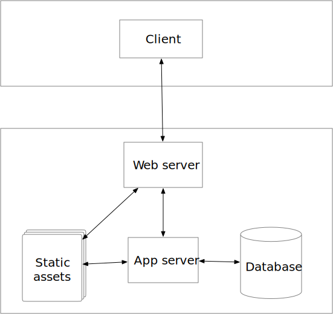

# Presentation

## Modern Web Architecture

</img>

## Prerequisites

* Basic familiarity with the command line
* npm and node installed

## [Unit testing](/unit-test)

### Instructions to work with sample project

1. `cd` inside the [unit-test](/unit-test) directory
2. Run `npm install`

## [React Demo](/react-demo)
## [Node Deployment](/node-deployment)

## References

